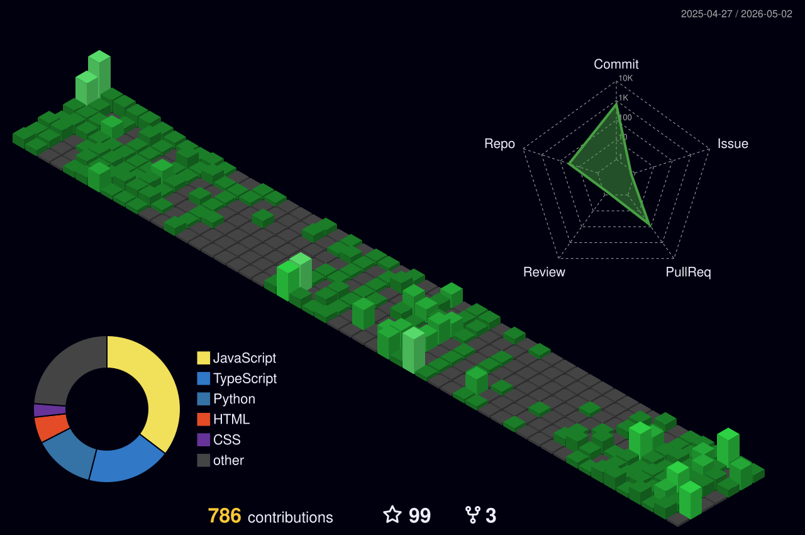

<h1 align="center">A helping hand is never small. </h1>

 IT student with a growing interest in web development, graphic design, and Python. Currently learning full‑stack web development, backend APIs, and basic AI/ML concepts, while building skills in modern development tools and technologies.

 

📈 Activity Graph

  

📊  GitHub Analytics

  

